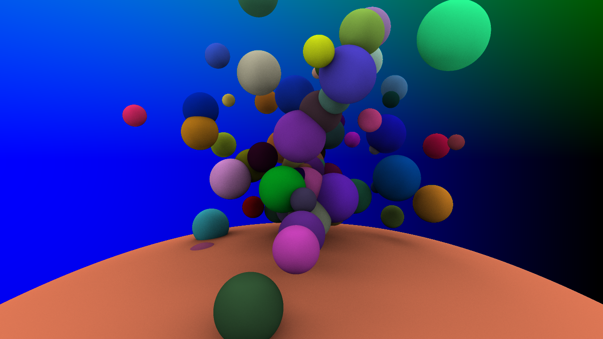

# Rust Ray Tracer

I decided it was time to learn some basic Rust and see what it's all about. In summary, it feels like C++ mixed with a bit of OCaml and has some extra type safety and compile-time checks added on top. I generally like the `cargo` commands used when compiling a build, and it's easy to specify a Debug or Release build with `cargo run --release`.

My first attempt with this ended with simple spheres and ambient occlusion. I tried to get super-sampling and multi-threading working but might get around to them later. This ray tracer is also the first one where it felt almost second-nature to implement the ray tracing algorithm (albeit in the simple object-oriented way). The subset of Rust I used seemed similar enough to C++ that I didn't need to think hard about how to structure type definitions and functions.

What stands out the most about Rust from this exercise is the number of times the compiler reminded me to add an `&` to values I passed to functions by reference.

 

